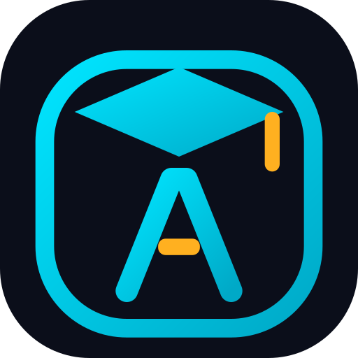
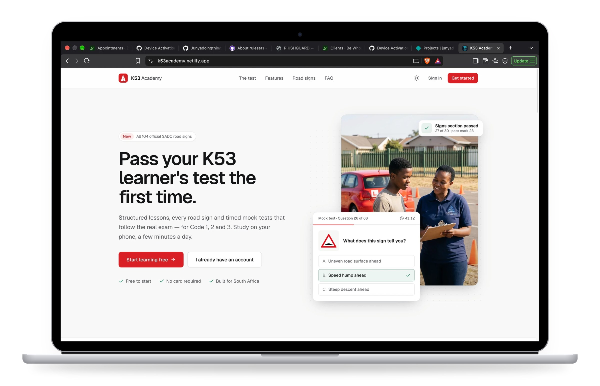
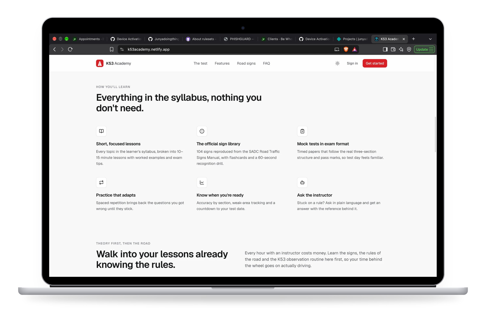
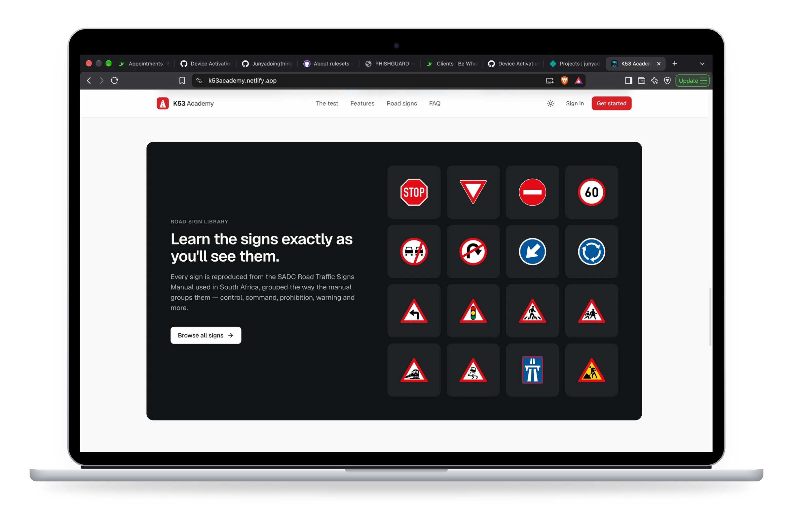
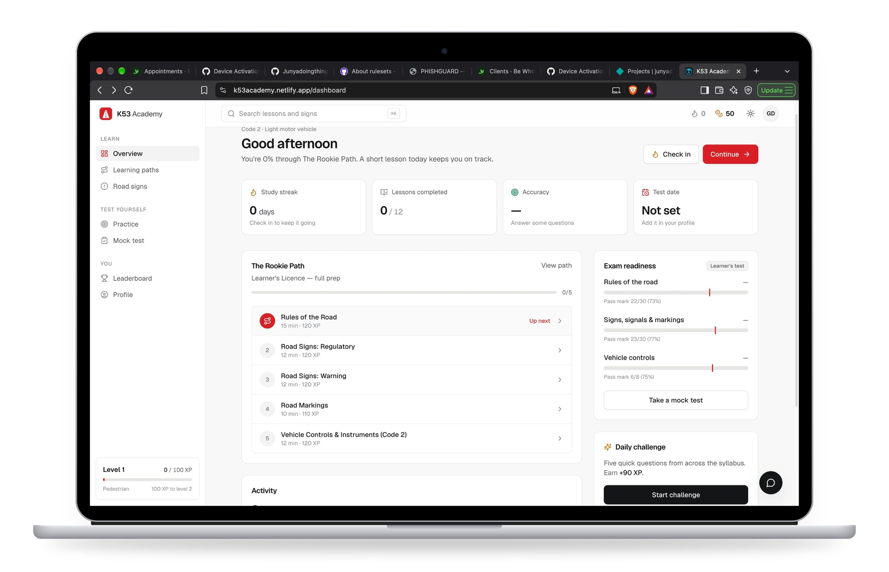
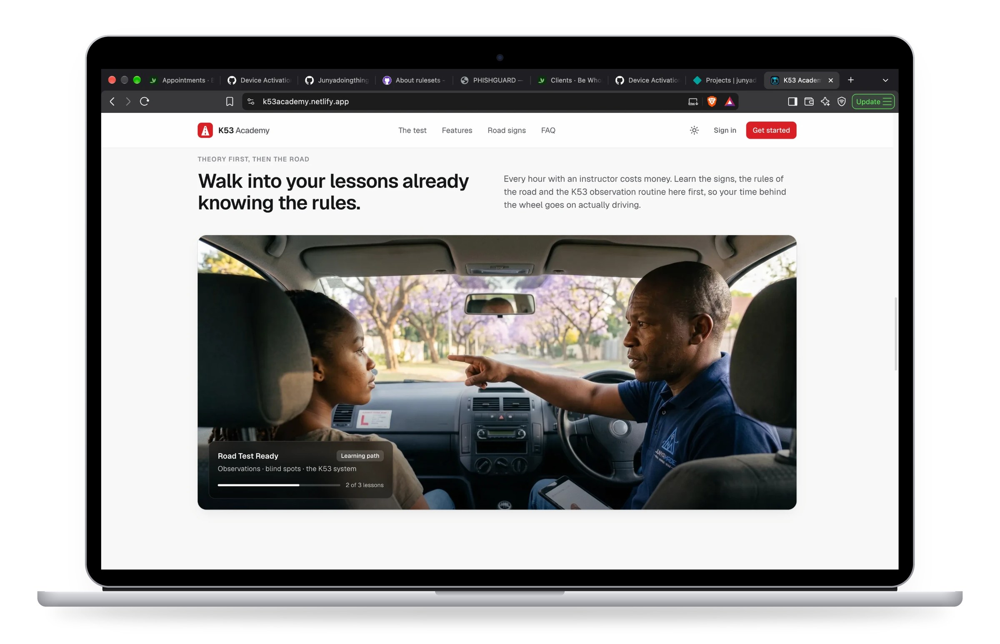
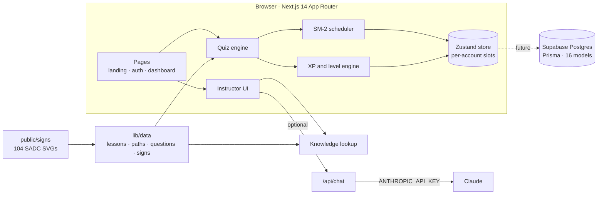

<div align="center">



# K53 Academy

**Pass your K53 learner's test the first time.**

A study app for the South African learner's and driver's licence. It has structured lessons, all 104 official SADC road signs, spaced-repetition practice and timed mock tests that follow the real exam, for Code 1, 2 and 3.

[](https://k53academy.netlify.app)
[](https://nextjs.org)
[](tsconfig.json)
[](https://k53academy.netlify.app)
[](LICENSE)

[**Open the app →**](https://k53academy.netlify.app) &nbsp;·&nbsp; [Features](#features) &nbsp;·&nbsp; [Engineering](#engineering-highlights) &nbsp;·&nbsp; [Architecture](#architecture) &nbsp;·&nbsp; [Run it locally](#getting-started)

<br />



</div>

---

## Why it exists

Most K53 study material in South Africa is a PDF or a wall of multiple-choice questions. It covers the syllabus, but few people finish it, and it gives you no sense of whether you are actually ready.

K53 Academy covers the same syllabus in a different way:

- **Short lessons** of 10 to 15 minutes each.
- **Signs drawn exactly as the official manual draws them.**
- **Practice that keeps bringing back the questions you got wrong.**
- **Mock papers with the same three sections and pass marks as the real test**, so you know where you stand before you book.

<table>
  <tr>
    <td align="center"><b>153</b><br /><sub>practice questions</sub></td>
    <td align="center"><b>104</b><br /><sub>official SADC signs</sub></td>
    <td align="center"><b>12</b><br /><sub>lessons</sub></td>
    <td align="center"><b>6</b><br /><sub>learning paths</sub></td>
    <td align="center"><b>3</b><br /><sub>licence codes</sub></td>
    <td align="center"><b>0</b><br /><sub>backend needed to run</sub></td>
  </tr>
</table>

---

## Features



| | |
|---|---|
| **Structured lessons** | 12 lessons cover rules of the road, regulatory and warning signs, road markings, the K53 defensive-driving system, alcohol and fatigue, emergencies, vehicle controls, motorcycle and heavy-vehicle topics, pre-trip inspection and the yard test. |
| **Learning paths** | 6 guided routes through the lessons: Rookie, Code 1, Code 2, Heavy Hauler, Yard Test Master and Road Test Ready. You always know what to study next. |
| **Official sign library** | All 104 signs come from the SADC Road Traffic Signs Manual: 52 regulatory, 39 warning, 5 information and 8 temporary. They're grouped the way the manual groups them, with flashcards and a timed recognition drill. |
| **Adaptive practice** | SM-2 spaced repetition brings back missed questions until you know them, and shows your weakest areas. |
| **Exam-format mock tests** | A 68-question, 60-minute paper split into the real sections and pass marks: rules 22 of 30, signs 23 of 30, controls 6 of 8. You pass only if you pass every section, as in the real test. |
| **Readiness dashboard** | Accuracy for each section measured against the pass mark, lessons completed, study streak and a countdown to your test date. |
| **Ask the instructor** | An in-app tutor that answers from the app's own K53 content and shows where the answer came from. It works offline and can optionally use Claude. |
| **Progress that motivates** | XP, 7 driving ranks from *Pedestrian* to *K53 Master*, 9 badges, daily challenges, streaks and a provincial leaderboard. |
| **Polished interface** | Light and dark themes, ⌘K search across lessons and signs, a mobile bottom nav and a web app manifest so you can add it to your home screen. |

<br />



<br />



<br />



---

## Engineering highlights

### Spaced repetition (SM-2)
Every question you answer gets a review card (`lib/spaced-repetition.ts`). The card tracks four things:
- **Repetitions:** how many times in a row you've got it right.
- **Ease factor:** how easy the question is for you. It never drops below 1.3.
- **Interval:** how many days until the question comes back.
- **Lapses:** how many times you've forgotten it.

Your answer is converted to a recall score from 0 to 5:
- **Score below 3:** the card is reset and comes back tomorrow.
- **Score of 3 or more:** the gap before the next review grows from 1 day, to 6 days, to the last gap multiplied by the ease factor.

A question counts as a **weak area** when it's due for review *and* has a low ease factor.

### Level curve
The XP needed to reach level *L* follows a gently accelerating curve. Early levels come quickly, and the top ranks take real commitment:

```math
\text{XP}(L) = \sum_{i=1}^{L-1} \operatorname{round}\left(100 \cdot i^{1.35}\right)
```

The rewards (`lib/xp-engine.ts`) are in one typed table with no magic numbers elsewhere. For example, finishing a lesson earns 120 XP, a perfect lesson adds 60, a mock test earns 150 and passing it adds 100.

### Mock papers that match the real exam
Each paper is put together from three section pools. Every pool is shuffled and filtered by licence code. A paper is a pass only if **every section** passes, as in the real test.

If the question bank can't fill a section yet, the pass mark is scaled to the same ratio, ⌈pass ÷ count × n⌉, and the app tells you the paper is shorter than the real one.

### Signs that become questions automatically
Sign artwork is stored as the official SVGs, named by sign number (for example `R1` is Stop and `W332` is Speed hump ahead). The name and meaning of each sign live in `lib/data/signs.ts`.

`lib/data/sign-questions.ts` turns every sign into a multiple-choice question, so adding a sign adds a question. **104 of the 153 questions are generated this way.**

- **Wrong answers are realistic.** They come from look-alike signs in the same group first, then from the same category, because the real test is designed around those mix-ups.
- **The page loads cleanly.** The answer options are shuffled the same way on the server and in the browser, so they don't jump around when the page finishes loading.

### The tutor works without an API key
The tutor first looks up the most relevant passages from the app's own content (`lib/assistant/knowledge.ts`) and answers from them on the device.

If `ANTHROPIC_API_KEY` is set, `/api/chat` sends those passages to Claude with a system prompt that keeps it to the syllabus. If the key isn't set, the route returns `501` and the app quietly switches to the on-device answers.

### Runs with no backend, built for one
- **Progress is stored per account.** Zustand stores it in the browser, with a separate slot for each account (`k53-progress:<user>`). You can switch accounts without losing anything.
- **The production data layer is already designed.** It's a 16-model Prisma schema for Postgres on Supabase, alongside integration points for Supabase Auth and Paystack (`lib/db.ts`, `lib/auth.ts`, `lib/paystack.ts`). Each file explains how to connect it.

---

## Architecture



---

## Tech stack

| Layer | Choice |
|---|---|
| Framework | Next.js 14 (App Router), React 18, TypeScript |
| Styling | Tailwind CSS with CSS-variable design tokens, light and dark themes, Geist type |
| State | Zustand with `persist`, one storage slot per account |
| Motion and charts | Framer Motion, Recharts |
| Icons | Lucide |
| Content | Typed content modules in `lib/data`, plus official SADC sign SVGs (public domain) |
| AI (optional) | Claude via `/api/chat`, using the app's own content |
| Data layer (planned) | Prisma, Supabase Postgres and Auth, Paystack |
| Hosting | Netlify (`@netlify/plugin-nextjs`) |

---

## Getting started

**You need:** Node.js 18 or newer, and npm.

```bash
git clone https://github.com/Junyadoingthings/K53-Academy.git
cd K53-Academy
npm install
npm run dev
```

Then open **http://localhost:5300**. No environment variables are needed. Everything runs on the device.

| Script | What it does |
|---|---|
| `npm run dev` | Development server on port 5300 |
| `npm run build` | Production build |
| `npm run start` | Serves the production build on port 5300 |
| `npx tsc --noEmit` | Type-checks the whole project |

### Environment variables (all optional)

Copy `.env.example` to `.env.local` and fill in only what you need.

| Variable | Used for |
|---|---|
| `ANTHROPIC_API_KEY` | Lets the instructor answer with Claude. Without it, answers come from the on-device lookup. |
| `NEXT_PUBLIC_SUPABASE_URL`, `NEXT_PUBLIC_SUPABASE_ANON_KEY`, `SUPABASE_SERVICE_ROLE_KEY` | Real accounts (planned) |
| `DATABASE_URL`, `DIRECT_URL` | Postgres for the Prisma schema (planned) |
| `NEXT_PUBLIC_PAYSTACK_PUBLIC_KEY`, `PAYSTACK_SECRET_KEY` | Payments (planned) |

---

## Project structure

```
K53-Academy/
├── app/
│   ├── page.tsx              Landing page
│   ├── (auth)/               Sign in, sign up, onboarding
│   ├── (dashboard)/          Dashboard, paths, lessons, signs, practice, mock test, leaderboard, profile
│   ├── admin/                Content overview
│   └── api/chat/             Optional Claude-backed instructor
├── components/
│   ├── quiz/                 Quiz engine
│   ├── signs/                Road sign rendering
│   ├── gamification/         XP bar, level ring, streaks, badges, toasts
│   ├── assistant/            In-app instructor
│   ├── layout/               App shell, sidebar, top bar, ⌘K search, mobile nav
│   └── ui/                   Button, card, pill, icon primitives
├── lib/
│   ├── data/                 Lessons, paths, questions, signs, generated sign questions
│   ├── spaced-repetition.ts  SM-2 scheduler
│   ├── xp-engine.ts          XP rewards, level curve, ranks
│   ├── store.ts              Progress store (Zustand, per account)
│   └── assistant/            Knowledge lookup for the instructor
├── prisma/schema.prisma      Production data model (16 models)
├── public/signs/             104 SADC road sign SVGs (see SOURCE.md)
└── docs/screenshots/         README images
```

---

## Deployment

The live site is on Netlify and uses the Next.js runtime plugin. To deploy your own copy:

```bash
npm i -g netlify-cli
netlify login
netlify init      # or: netlify link
netlify deploy --build --prod
```

Static assets under `/_next/static/*` are served with a one-year immutable cache.

---

## Content accuracy

Learners rely on these answers, so getting them right matters more than adding more of them.

- Sign artwork comes from the public-domain SADC road sign set on Wikimedia Commons. The file names match the official sign numbers (see [`public/signs/SOURCE.md`](public/signs/SOURCE.md)).
- Mock-test section sizes and pass marks follow the official learner's test.
- If you find a wrong answer or an out-of-date rule, please [open an issue](https://github.com/Junyadoingthings/K53-Academy/issues/new/choose) and include a source.

---

## Roadmap

- [x] Official SADC sign library with questions generated from it
- [x] SM-2 spaced repetition and weak-area tracking
- [x] Mock tests in the real exam format, with per-section pass marks
- [x] Instructor that answers from the app's content, with optional Claude
- [ ] Connect Supabase Auth and Postgres so progress syncs across devices
- [ ] Paystack for premium plans
- [ ] Expand the rules-of-the-road and vehicle-controls question pools to fill the full 68-question paper
- [ ] Offline support with a service worker
- [ ] Afrikaans and isiZulu translations

---

## Contributing

Contributions are welcome, especially corrections to questions and translations. See [CONTRIBUTING.md](CONTRIBUTING.md).

---

## Disclaimer

K53 Academy is an **independent study tool**. It is not affiliated with or endorsed by the Road Traffic Management Corporation (RTMC), the Department of Transport or any South African government entity.

The study content is original. It covers the road traffic regulations that the official test assesses and does not reproduce any copyrighted K53 publication. Passing the mock tests in this app does not guarantee that you will pass the official test. Always confirm the current requirements with your licensing department.

---

## Licence

MIT. See [LICENSE](LICENSE). The road sign artwork in `public/signs/` is in the public domain.

<div align="center">
<br />
<sub>Built by <b>Junya</b> in Springs, Gauteng 🇿🇦 · <a href="https://k53academy.netlify.app">k53academy.netlify.app</a></sub>
</div>
